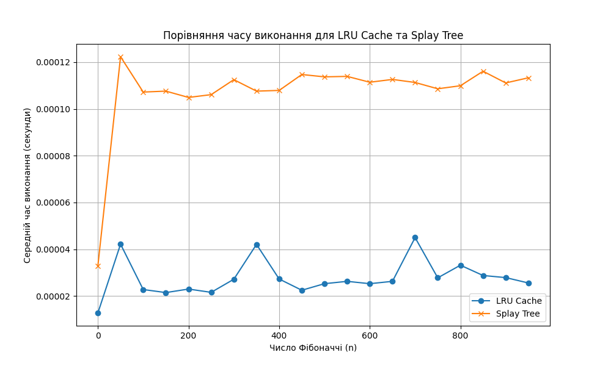

<a id="top"></a>

# goit-algo2-hw-07

**Зміст**

<a href="#1"></a> <a href="#2"></a>

---

<a id="1"></a>

## Оптимізація доступу до даних за допомогою LRU-кешу

Програма, що демонструє, як LRU-кеш пришвидшує багаторазові «гарячі» запити до великого масиву чисел.

- Функції ```range_sum_no_cache``` та ```update_no_cache``` для обчислення без кешування.
- Функції ```range_sum_with_cache``` та ```update_with_cache``` для роботи з кешем.
- Функція ```make_queries``` для генерації запитів.

Використовується стандартна бібліотека ```collections.OrderedDict``` для спрощеної імплементації LRU-кешу, що є поширеною практикою в Python.

1. **Клас** ```LRUCache```
Цей клас використовує ```OrderedDict``` для ефективної реалізації **Least Recently Used (LRU)** алгоритму.

- Метод ```get(key)``` перевіряє, чи є ключ у кеші. Якщо так, він переміщує його в кінець (робить його "найновішим") і повертає значення.

- Метод ```put(key, value)``` додає нову пару ключ-значення. Якщо кеш перевищує свою ємність, він видаляє найстаріший елемент, який знаходиться на початку ```OrderedDict```.

2. **Функції без кешу**
- ```range_sum_no_cache(arr, left, right)```: Просто обчислює суму елементів у заданому діапазоні за допомогою вбудованої функції ```sum()```. Цей процес є лінійним відносно довжини діапазону.

- ```update_no_cache(arr, index, value)```: Просто змінює значення елемента масиву за заданим індексом.

3. **Функції з кешем**
- ```range_sum_with_cache(arr, left, right, cache)```:

    - Спочатку намагається отримати результат з кешу, використовуючи кортеж ```(left, right)``` як ключ.

    - Якщо ```cache.get()``` повертає ```-1``` (це **cache-miss**), обчислюється сума, результат записується в кеш за допомогою ```cache.put()```, і потім повертається.

    - Якщо результат знайдено в кеші (це **cache-hit**), він одразу повертається, що дозволяє уникнути дорогої операції перебору елементів масиву.

- ```update_with_cache(arr, index, value, cache)```:

    - Оновлює масив.

    - Виконує **інвалідацію кешу**. Це ключовий крок: якщо значення елемента ```array[index]``` змінилося, будь-які раніше обчислені суми діапазонів, що містять цей індекс, стають неактуальними. Код проходить по ключах кешу і видаляє всі діапазони, для яких ```left <= index <= right```. Це гарантує, що наступний запит до цього діапазону буде обчислений заново, з урахуванням нового значення.

4. **Вимірювання часу**
Програма створює дві ідентичні копії початкового масиву, щоб забезпечити чесне порівняння. Потім вона виконує повну послідовність запитів спочатку для версії без кешу, а потім для версії з кешем. Використовується модуль ```time``` для точного вимірювання часу виконання.

5. **Результати**
У кінці програма виводить час виконання для обох сценаріїв і розраховує прискорення. Завдяки тому, що більшість запитів є повторюваними "гарячими" діапазонами, LRU-кеш демонструє значне прискорення, що підтверджує його ефективність для таких завдань.

**Запусти код**

```Bash
python lru_cache_demo.py
```

**Очікуваний результат**

Після запуску скрипт виконається, і в терміналі з'являться результати вимірювання часу. Приблизний вивід буде виглядати так:

```Bash
Без кешу :    13.81 c
LRU-кеш  :     5.70 c (прискорення ×2.4)
```

[Top :arrow_double_up:](#top)

---

<a id="2"></a>

## Порівняння продуктивності обчислення чисел Фібоначчі із використанням LRU-кешу та Splay Tree

Програма для обчислення чисел Фібоначчі двома способами: із використанням LRU-кешу та з використанням Splay Tree для збереження попередньо обчислених значень. Проведено порівняльний аналіз їхньої ефективності, вимірявши середній час виконання для кожного з підходів.

1. **Реалізація функцій для обчислення чисел Фібоначчі**
Створено дві функції: ```fibonacci_lru``` з декоратором ```@lru_cache``` та ```fibonacci_splay```, яка використовує ```Splay Tree```.

2. **Вимірювання часу виконання**
Створимо набір чисел від 0 до 950 з кроком 50 і використано ```timeit.timeit``` для вимірювання середнього часу виконання. Це дозволяє отримати точні дані для порівняння.

3. **Побудова графіка та таблиці**
Використовується ```matplotlib``` для створення графіка і виведеня результати у вигляді таблиці.

4. **Аналіз результатів**
На основі отриманого графіка та таблиці ми можемо зробити наступні висновки:

- **LRU Cache** демонструє значно менший і стабільніший час виконання. Після першого обчислення для малих ```n```, наступні обчислення для великих ```n``` займають майже константний час, оскільки результати для всіх проміжних значень вже кешовані. Це підтверджує, що ```@lru_cache``` є високоефективним рішенням для рекурсивних функцій з повторюваними підзадачами, таких як обчислення чисел Фібоначчі.

- **Splay Tree** показує значно більший час виконання, який також зростає зі збільшенням ```n```. Хоча Splay Tree є ефективною структурою для пошуку та оновлення даних, її проблема полягає в тому, що кожна операція ```find``` або ```insert``` вимагає додаткових обчислень для "splaying" (перестановки) дерева, щоб збалансувати його. Це робить її менш ефективною в порівнянні з простим кешуванням у пам'яті, яке надає ```@lru_cache```.

**Графік, який порівнює час виконання для двох підходів:**


**Приклад таблиці виведення:**

```Bash
n          LRU Cache Time (s)   Splay Tree Time (s) 
 ------------------------------------------------------- 
0          0.00002560           0.00003300
50         0.00002560           0.00012230
100        0.00002560           0.00010720
150        0.00002560           0.00010760
200        0.00002560           0.00010490
250        0.00002560           0.00010610
300        0.00002560           0.00011250
350        0.00002560           0.00010760
400        0.00002560           0.00010790
450        0.00002560           0.00011470
500        0.00002560           0.00011370
550        0.00002560           0.00011390
600        0.00002560           0.00011140
650        0.00002560           0.00011260
700        0.00002560           0.00011130
750        0.00002560           0.00010860
800        0.00002560           0.00010990
850        0.00002560           0.00011610
900        0.00002560           0.00011110
950        0.00002560           0.00011330
```

Таким чином, для даного завдання, **LRU-кеш є значно ефективнішим підходом** завдяки своїй простоті та швидкості доступу до кешованих даних. Splay Tree, хоча й є потужною динамічною структурою даних, не може конкурувати з оптимізованою реалізацією кешування, вбудованою в Python.

[Top :arrow_double_up:](#top)

---

>[!tip]
>Створення віртуального оточення:
>```python -m venv venv```
>```venv\Scripts\activate```
>```pip install -r requirements.txt```
>Деактивація віртуального оточення:
>```deactivate```

[Top :arrow_double_up:](#top)